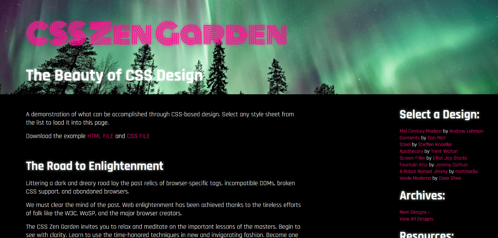

# <a href="https://advaitju.github.io/My-CSS-Zen-Garden-Design/">My CSS Zen Garden Design</a>
### <a href="https://advaitju.github.io/My-CSS-Zen-Garden-Design/">View design</a>

## About
My cool and usability-focused take on the CSS Zen Garden challenge.

## What is the _CSS Zen Garden_ challenge?
The challenge requires that developers use the same skeleton HTML without modification and supply their own CSS to create a design.

More info: http://www.csszengarden.com/
